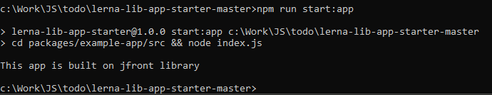

[SOFTSPIDERS](https://github.com/softspiders/softspiders)

# lerna-lib-app-starter

Minimalistic JS library development environment on Lerna

---

## Feature tags

- app
- build
- lerna
- lib
- starter
- template

---

## Direct ancestors

[Starter for Lerna monorepo](https://github.com/softspiders/lerna)

## Direct descendants

[lerna-react-app-uilib-starter](https://github.com/softspiders/lerna-react-app-uilib-starter)

## Authors

[Asoyan Danila](https://github.com/Danilkashtan)

---

## Install
1. Clone this repo
2. Install dependencies
   ```sh
   # yarn is fine too
   npm i
   ```
3. Run bootstrap
   ```sh
   npm run bootstrap
   ```

   This will bootstrap and link between app and lib
4. Now, it's ready!

## Dev flow
1. Run start
   ```sh
   npm run start:app
   ```

   If everything is alright, you will see:
   <p align="center">
	   <div">
	   		
	   </div>
	</p>
2. Try changing the lib, it should reflect the changes directly
3. Now, you can start developing your own library!

---

### License

Licensed under the [MIT license](./LICENSE). 


